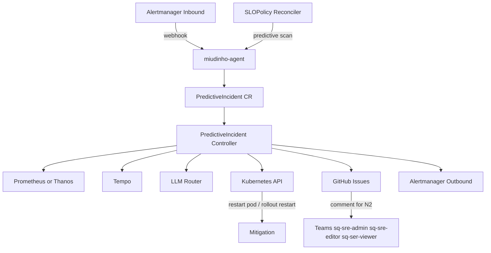

# miudinho-agent

Operator Kubernetes para detecção de incidentes, RCA automatizado, remediação controlada e escalonamento operacional.

## O que ele faz

- recebe incidentes via webhook do Alertmanager em `/api/v1/alerts`
- gera incidentes preditivos com base em `SLOPolicy`
- enriquece incidentes com evidências de Prometheus e Tempo
- executa RCA com suporte a Ollama e Gemini
- aplica guardrails antes de qualquer ação mutável
- pode reiniciar pod ou fazer rollout restart de deployment
- abre issue no GitHub para cada incidente quando a integração estiver habilitada
- escala para N2 comentando na issue e enviando alerta para o Alertmanager outbound
- fecha a issue quando o incidente for mitigado ou resolvido

## Recursos

### CRDs

- `PredictiveIncident`
- `AutoRemediationPolicy`
- `SLOPolicy`

### Fontes de incidente

- Alertmanager webhook
- análise preditiva por `SLOPolicy`
- source manual ou outros producers compatíveis com `PredictiveIncident`

### Fases do incidente

- `New`
- `Enriched`
- `Blocked`
- `Escalated`
- `Mitigated`
- `Resolved`

## Arquitetura



## Fluxo operacional

### 1. Detecção

O operador recebe ou cria um `PredictiveIncident`.

### 2. Enriquecimento

O controller consulta:

- `PROM_URL` para sinais de erro
- `TEMPO_URL` para hints de traces

### 3. RCA e aprovação

O motor de decisão analisa o incidente e aplica o modo configurado em `LLM_ROUTING_MODE`.

### 4. Ação

Se houver policy aplicável, aprovação e `EXECUTE_ACTIONS=true`, o operador pode:

- reiniciar pod
- fazer rollout restart de deployment
- escalar

Se não houver condição segura para agir, o incidente fica enriquecido ou bloqueado.

### 5. Integrações operacionais

Quando habilitadas:

- uma issue é aberta no GitHub para todo incidente
- a issue é criada no mono-repo `apps-<produto>`
- no escalonamento para N2, a issue recebe comentário mencionando:
  `sq-sre-admin`, `sq-sre-editor`, `sq-ser-viewer`
- no escalonamento para N2, um alerta também é enviado para `ALERTMANAGER_OUTBOUND_URL`
- quando o incidente entra em `Mitigated` ou `Resolved`, a issue é fechada

## Configuração

### Observabilidade

- `PROM_URL`
- `TEMPO_URL`
- `TEMPO_PREDICTIVE_PATH`
- `TEMPO_PREDICTIVE_QUERY_PARAM`
- `ALERTMANAGER_OUTBOUND_URL`

### LLM

- `LLM_ROUTING_MODE`
- `OLLAMA_BASE_URL`
- `OLLAMA_MODEL`
- `GEMINI_BASE_URL`
- `GEMINI_MODEL`
- `GOOGLE_API_KEY`

### GitHub

- `GITHUB_TOKEN`
- `GITHUB_OWNER`
- `GITHUB_PRODUCT_NAME`
- `GITHUB_N2_TEAMS`

`GITHUB_PRODUCT_NAME=foo` faz o operador usar o repositório `apps-foo`.

### Execução

- `EXECUTE_ACTIONS`
- `AUTO_OBSERVE_ONLY`
- `OBSERVE_ONLY_TTL_SECONDS`

### Webhook inbound

- `ALERT_WEBHOOK_ADDR`

## Modos de LLM

- `ollama_only`
- `gemini_only`
- `ollama_decide_gemini_approve`
- `gemini_decide_ollama_approve`
- `ollama_primary_gemini_fallback`
- `gemini_primary_ollama_fallback`

## Build

```bash
go mod tidy
go build -o bin/manager ./cmd/manager
```

### Docker

```bash
docker build -t seu-registry/miudinho-agent:0.1 .
docker push seu-registry/miudinho-agent:0.1
```

## Deploy

O projeto usa Helm.

### Instalação básica

```bash
helm upgrade --install miudinho-agent ./charts/miudinho-agent \
  --namespace o11y \
  --create-namespace \
  --set image.repository=seu-registry/miudinho-agent \
  --set image.tag=0.1 \
  --set secret.googleApiKey="$GOOGLE_API_KEY"
```

### Instalação com GitHub e Alertmanager outbound

```bash
helm upgrade --install miudinho-agent ./charts/miudinho-agent \
  --namespace o11y \
  --create-namespace \
  --set image.repository=seu-registry/miudinho-agent \
  --set image.tag=0.1 \
  --set secret.googleApiKey="$GOOGLE_API_KEY" \
  --set secret.githubToken="$GITHUB_TOKEN" \
  --set env.githubOwner=seu-org \
  --set env.githubProductName=produto \
  --set env.githubN2Teams="sq-sre-admin,sq-sre-editor,sq-ser-viewer" \
  --set env.alertmanagerOutboundUrl=http://alertmanager-operated.o11y.svc.cluster.local:9093/api/v2/alerts
```

### Reutilizando secret existente

```bash
helm upgrade --install miudinho-agent ./charts/miudinho-agent \
  --namespace o11y \
  --create-namespace \
  --set image.repository=seu-registry/miudinho-agent \
  --set image.tag=0.1 \
  --set secret.create=false \
  --set secret.name=miudinho-agent-secrets
```

### Samples

```bash
kubectl -n o11y apply -f examples/autoremediationpolicy.yaml
kubectl -n o11y apply -f examples/slopolicy.yaml
```

## Values do chart

Os principais valores estão em [charts/miudinho-agent/values.yaml](/Users/well/code-mac/miudinho-agent/charts/miudinho-agent/values.yaml:1):

- `image.repository`
- `image.tag`
- `secret.googleApiKey`
- `secret.githubToken`
- `env.githubOwner`
- `env.githubProductName`
- `env.githubN2Teams`
- `env.alertmanagerOutboundUrl`
- `env.llmRoutingMode`
- `env.executeActions`

## Healthchecks

- manager probe: `/healthz`
- manager ready: `/readyz`
- webhook inbound: `/api/v1/alerts`

## Exemplo de receiver do Alertmanager

```yaml
receivers:
  - name: miudinho-agent
    webhook_configs:
      - url: http://miudinho-agent.o11y.svc.cluster.local:8090/api/v1/alerts
```

## Comandos úteis

```bash
make build
make generate
make manifests
make deploy IMG=seu-registry/miudinho-agent VERSION=0.1
```

## Observações

- use `EXECUTE_ACTIONS=false` por padrão
- habilite ações mutáveis só depois de validar policies e guardrails
- a integração com GitHub só é ativada se `GITHUB_TOKEN` e `GITHUB_OWNER` estiverem definidos
- o envio outbound para Alertmanager só é ativado se `ALERTMANAGER_OUTBOUND_URL` estiver definido
- o repositório ainda tem pendências de build fora do `README`, como dependências ausentes em `go.sum` e código legado em `internal/rca`
