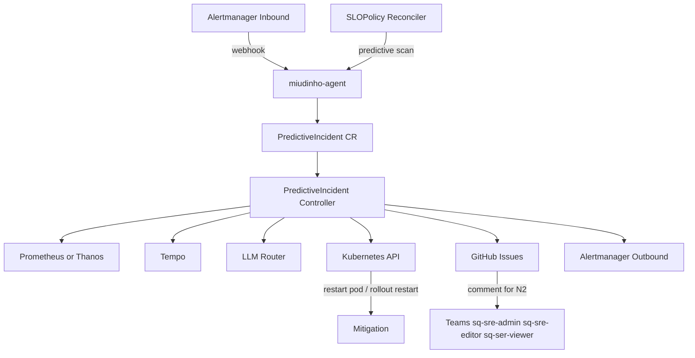

# miudinho-agent

Operator Kubernetes para detecção de incidentes, RCA automatizado, remediação controlada e escalonamento operacional.

## Visão geral

O `miudinho-agent` observa sinais de incidente, cria recursos `PredictiveIncident`, enriquece contexto com Prometheus e Tempo, consulta um motor de decisão baseado em LLM e decide entre observar, bloquear, mitigar ou escalar o caso.

Principais capacidades:

- recebe alertas do Alertmanager em `/api/v1/alerts`
- gera incidentes preditivos a partir de `SLOPolicy`
- enriquece incidentes com dados de Prometheus e Tempo
- executa RCA com Ollama e/ou Gemini
- aplica guardrails antes de ações mutáveis
- pode reiniciar pods ou executar rollout restart em deployments
- integra com GitHub Issues para acompanhamento e escalonamento operacional

## Recursos Kubernetes

O projeto expõe três CRDs:

- `PredictiveIncident`
- `AutoRemediationPolicy`
- `SLOPolicy`

Os manifests gerados dessas CRDs ficam em `config/crd/bases/` e são copiados para `charts/miudinho-agent/crds/` pelo alvo `make manifests`.

## Fluxo operacional

1. Um incidente entra por webhook do Alertmanager ou é criado por análise preditiva via `SLOPolicy`.
2. O controller cria ou atualiza um `PredictiveIncident`.
3. O incidente é enriquecido com evidências de Prometheus e Tempo.
4. O motor de RCA consulta o modo configurado em `LLM_ROUTING_MODE`.
5. O operador decide entre observar, bloquear, mitigar ou escalar.
6. Quando habilitado, o incidente abre ou atualiza uma issue no GitHub e pode enviar alerta outbound para outro Alertmanager.

Fases esperadas do incidente:

- `New`
- `Enriched`
- `Blocked`
- `Escalated`
- `Mitigated`
- `Resolved`

## Arquitetura



## Requisitos

- Go `1.22+`
- Docker para build de imagem
- Helm `3.x`
- acesso a um cluster Kubernetes para instalação

## Desenvolvimento local

### Build

```bash
make build
```

Binário gerado: `bin/manager`.

Build direto com Go:

```bash
go mod tidy
go build -o bin/manager ./cmd/manager
```

### Testes e validações

```bash
make fmt
make vet
make test
make lint
```

Rodando direto com Go:

```bash
go test ./...
```

Hoje a suíte cobre principalmente componentes isolados e sem dependência de cluster:

- `internal/rca`
- `internal/githubissues`
- `internal/alertmanager`
- `internal/telemetry`

### Executar localmente

```bash
make run
```

Ou executando o binário compilado:

```bash
./bin/manager
```

Se quiser subir com algumas variáveis locais:

```bash
export ALERT_WEBHOOK_ADDR=:8090
export LLM_ROUTING_MODE=ollama_only
export PROM_URL=http://localhost:9090
export TEMPO_URL=http://localhost:3100
./bin/manager
```

O binário inicia:

- webhook inbound em `ALERT_WEBHOOK_ADDR` com padrão `:8090`
- probes do controller-runtime em `:8080`
- métricas do controller-runtime em `:8081`

Se o ambiente local tiver restrições de cache do Go, você pode isolar os diretórios de cache dentro do workspace:

```bash
env GOMODCACHE=$(pwd)/.gomodcache GOCACHE=$(pwd)/.gocache go test ./...
env GOMODCACHE=$(pwd)/.gomodcache GOCACHE=$(pwd)/.gocache go build -o bin/manager ./cmd/manager
```

## Geração de manifests

O projeto não usa mais manifests de instalação em `config/manager` ou `config/rbac`. O caminho suportado para deploy é Helm.

Para regenerar CRDs a partir do código:

```bash
make manifests
```

Esse alvo:

- gera CRDs em `config/crd/bases/`
- copia os mesmos arquivos para `charts/miudinho-agent/crds/`

## Build da imagem

```bash
make docker-build IMG=seu-registry/miudinho-agent VERSION=0.1.0
make docker-push IMG=seu-registry/miudinho-agent VERSION=0.1.0
```

O `Dockerfile` gera a imagem a partir de `./cmd/manager` usando Go `1.22` e runtime distroless.

## Deploy com Helm

Instalação básica:

```bash
helm upgrade --install miudinho-agent ./charts/miudinho-agent \
  --namespace o11y \
  --create-namespace \
  --set image.repository=seu-registry/miudinho-agent \
  --set image.tag=0.1.0 \
  --set secret.googleApiKey="$GOOGLE_API_KEY"
```

Instalação com integrações de GitHub e Alertmanager outbound:

```bash
helm upgrade --install miudinho-agent ./charts/miudinho-agent \
  --namespace o11y \
  --create-namespace \
  --set image.repository=seu-registry/miudinho-agent \
  --set image.tag=0.1.0 \
  --set secret.googleApiKey="$GOOGLE_API_KEY" \
  --set secret.githubToken="$GITHUB_TOKEN" \
  --set env.githubOwner=seu-org \
  --set env.githubProductName=produto \
  --set env.githubN2Teams="sq-sre-admin,sq-sre-editor,sq-ser-viewer" \
  --set env.alertmanagerOutboundUrl=http://alertmanager-operated.o11y.svc.cluster.local:9093/api/v2/alerts
```

Usando os alvos do `Makefile`:

```bash
make install IMG=seu-registry/miudinho-agent VERSION=0.1.0 NAMESPACE=o11y
make uninstall NAMESPACE=o11y
```

`make install` e `make deploy` executam `make manifests` antes do `helm upgrade --install`.

## Configuração

### Variáveis de observabilidade

- `PROM_URL`
- `TEMPO_URL`
- `TEMPO_PREDICTIVE_PATH`
- `TEMPO_PREDICTIVE_QUERY_PARAM`
- `ALERTMANAGER_OUTBOUND_URL`

### Variáveis de LLM

- `LLM_ROUTING_MODE`
- `OLLAMA_BASE_URL`
- `OLLAMA_MODEL`
- `GEMINI_BASE_URL`
- `GEMINI_MODEL`
- `GOOGLE_API_KEY`

### Variáveis de GitHub

- `GITHUB_TOKEN`
- `GITHUB_OWNER`
- `GITHUB_PRODUCT_NAME`
- `GITHUB_N2_TEAMS`

`GITHUB_PRODUCT_NAME=foo` faz o operador interagir com o repositório `apps-foo`.

### Variáveis de execução

- `ALERT_WEBHOOK_ADDR`
- `EXECUTE_ACTIONS`
- `AUTO_OBSERVE_ONLY`
- `OBSERVE_ONLY_TTL_SECONDS`

## Modos de LLM

- `ollama_only`
- `gemini_only`
- `ollama_decide_gemini_approve`
- `gemini_decide_ollama_approve`
- `ollama_primary_gemini_fallback`
- `gemini_primary_ollama_fallback`

## Principais values do chart

Os valores padrão estão em [charts/miudinho-agent/values.yaml](/Users/well/code-mac/miudinho-agent/charts/miudinho-agent/values.yaml:1).

Campos mais usados:

- `image.repository`
- `image.tag`
- `image.pullPolicy`
- `service.type`
- `service.ports.webhook`
- `service.ports.probe`
- `secret.create`
- `secret.name`
- `secret.googleApiKey`
- `secret.githubToken`
- `serviceAccount.create`
- `serviceAccount.name`
- `rbac.create`
- `env.alertWebhookAddr`
- `env.alertmanagerOutboundUrl`
- `env.promUrl`
- `env.tempoUrl`
- `env.ollamaBaseUrl`
- `env.ollamaModel`
- `env.geminiBaseUrl`
- `env.geminiModel`
- `env.githubOwner`
- `env.githubProductName`
- `env.githubN2Teams`
- `env.llmRoutingMode`
- `env.autoObserveOnly`
- `env.observeOnlyTtlSeconds`
- `env.executeActions`

Se você já possui um `Secret` existente:

```bash
helm upgrade --install miudinho-agent ./charts/miudinho-agent \
  --namespace o11y \
  --create-namespace \
  --set image.repository=seu-registry/miudinho-agent \
  --set image.tag=0.1.0 \
  --set secret.create=false \
  --set secret.name=miudinho-agent-secrets
```

Nesse caso, o secret precisa expor as chaves:

- `GOOGLE_API_KEY`
- `GITHUB_TOKEN`

## Samples

Exemplos disponíveis:

- [examples/autoremediationpolicy.yaml](/Users/well/code-mac/miudinho-agent/examples/autoremediationpolicy.yaml:1)
- [examples/slopolicy.yaml](/Users/well/code-mac/miudinho-agent/examples/slopolicy.yaml:1)

Aplicação manual:

```bash
kubectl -n o11y apply -f examples/autoremediationpolicy.yaml
kubectl -n o11y apply -f examples/slopolicy.yaml
```

Ou via `Makefile`:

```bash
make apply-samples
```

## Endpoints e health checks

- webhook inbound: `/api/v1/alerts`
- liveness HTTP: `/healthz` na porta `8080`
- readiness HTTP: `/readyz` na porta `8080`
- métricas do controller-runtime: porta `8081`

O `Service` do chart expõe apenas as portas de webhook e probe.

Exemplo de receiver do Alertmanager:

```yaml
receivers:
  - name: miudinho-agent
    webhook_configs:
      - url: http://miudinho-agent.o11y.svc.cluster.local:8090/api/v1/alerts
```
