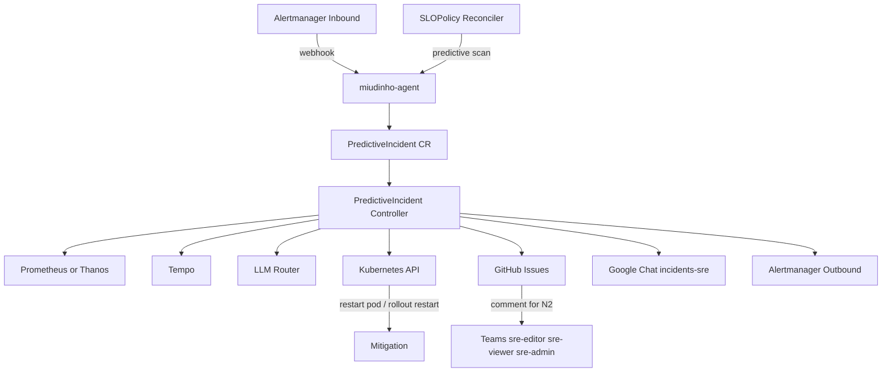

# miudinho-agent

Operator Kubernetes para detecção de incidentes, RCA automatizado, remediação controlada e escalonamento operacional.

## Visão geral

O `miudinho-agent` observa sinais de incidente, cria recursos `PredictiveIncident`, enriquece contexto com Prometheus e Tempo, consulta um motor de decisão baseado em LLM e decide entre observar, bloquear, mitigar ou escalar o caso.

Principais capacidades:

- recebe alertas do Alertmanager em `/api/v1/alerts`
- consulta alertas ativos por polling em Prometheus e Alertmanager API
- gera incidentes preditivos a partir de `SLOPolicy` global ou específico
- enriquece incidentes com dados de Prometheus e Tempo
- executa RCA com Ollama e/ou Gemini
- aplica guardrails antes de ações mutáveis
- pode reiniciar pods ou executar rollout restart em deployments
- integra com GitHub Issues, Google Chat e escalonamento operacional

## Recursos Kubernetes

O projeto expõe três CRDs:

- `PredictiveIncident`
- `AutoRemediationPolicy`
- `SLOPolicy`

Os manifests gerados dessas CRDs ficam em `config/crd/bases/` e são copiados para `charts/miudinho-agent/crds/` pelo alvo `make manifests`.

## Fluxo operacional

1. Um incidente entra por webhook do Alertmanager, por polling nas APIs de alertas, ou é criado por análise preditiva via `SLOPolicy`.
2. O controller cria ou atualiza um `PredictiveIncident`.
3. O incidente é enriquecido com evidências de Prometheus e Tempo.
4. O motor de RCA consulta o modo configurado em `LLM_ROUTING_MODE`.
5. O operador decide entre observar, bloquear, mitigar ou escalar.
6. Quando habilitado, o incidente abre ou atualiza uma issue no GitHub, fecha a issue na resolução e pode escalar para N2 via comentário, Alertmanager outbound e Google Chat.

Fases esperadas do incidente:

- `New`
- `Enriched`
- `Blocked`
- `Escalated`
- `Mitigated`
- `Resolved`

## Arquitetura



## Requisitos

- Go `1.25.9+`
- Docker para build de imagem
- Helm `3.x`
- acesso a um cluster Kubernetes para instalação

Versão recomendada:

- usar Go `1.25.9` ou superior
- evitar builds em `go1.25.0` até `go1.25.8` por correções de segurança da stdlib identificadas por `govulncheck`

## Desenvolvimento local

### Build

```bash
make build
```

Binário gerado: `bin/manager`.

Build direto com Go:

```bash
go mod tidy
go build -o bin/manager ./cmd/manager
```

### Testes e validações

```bash
make fmt
make vet
make test
make lint
```

Rodando direto com Go:

```bash
go test ./...
```

Hoje a suíte cobre principalmente componentes isolados e sem dependência de cluster:

- `internal/rca`
- `internal/githubissues`
- `internal/alertmanager`
- `internal/telemetry`
- `controllers` para transições críticas do reconciler de incidentes

### Executar localmente

```bash
make run
```

Ou executando o binário compilado:

```bash
./bin/manager
```

Se quiser subir com algumas variáveis locais:

```bash
export ALERT_WEBHOOK_ADDR=:8090
export LLM_ROUTING_MODE=ollama_only
export PROM_URL=http://localhost:9090
export TEMPO_URL=http://localhost:3100
export LEADER_ELECTION=false
./bin/manager
```

O binário inicia:

- webhook inbound em `ALERT_WEBHOOK_ADDR` com padrão `:8090`
- probes do controller-runtime em `:8080`
- métricas do controller-runtime em `:8081`

Métricas customizadas expostas no mesmo endpoint `/metrics`:

- `miudinho_agent_reconcile_total`
- `miudinho_agent_reconcile_duration_seconds`
- `miudinho_agent_alertmanager_webhook_requests_total`
- `miudinho_agent_alertmanager_webhook_request_duration_seconds`
- `miudinho_agent_alert_poll_requests_total`
- `miudinho_agent_alerts_collected_total`
- `miudinho_agent_alerts_deduplicated_total`
- `miudinho_agent_resolved_alerts_total`

Se o ambiente local tiver restrições de cache do Go, você pode isolar os diretórios de cache dentro do workspace:

```bash
env GOMODCACHE=$(pwd)/.gomodcache GOCACHE=$(pwd)/.gocache go test ./...
env GOMODCACHE=$(pwd)/.gomodcache GOCACHE=$(pwd)/.gocache go build -o bin/manager ./cmd/manager
```

## Geração de manifests

O projeto não usa mais manifests de instalação em `config/manager` ou `config/rbac`. O caminho suportado para deploy é Helm.

Para regenerar CRDs a partir do código:

```bash
make manifests
```

Esse alvo:

- gera CRDs em `config/crd/bases/`
- copia os mesmos arquivos para `charts/miudinho-agent/crds/`

## Build da imagem

```bash
make docker-build IMG=seu-registry/miudinho-agent VERSION=0.1.0
make docker-push IMG=seu-registry/miudinho-agent VERSION=0.1.0
```

O `Dockerfile` gera a imagem a partir de `./cmd/manager` usando Go `1.25.9` e runtime distroless.

## CI/CD no GitHub

O workflow [`.github/workflows/ci-ghcr.yml`](.github/workflows/ci-ghcr.yml) executa em `pull_request`, `push` para `main`, tags `v*` e `workflow_dispatch`.

Etapas de validação:

- `lint`: `go mod tidy`, verificação de `go.mod` e `go.sum`, `gofmt`, `go vet`, `golangci-lint` e `helm lint`
- `test`: `go test ./...` com geração de `cover.out` e `go build ./cmd/manager`
- `security`: `govulncheck ./...` e `trivy` para scan de vulnerabilidades em dependências

Publicação automática:

- imagem Docker em `ghcr.io/<owner>/<repo>`
- chart Helm OCI em `oci://ghcr.io/<owner>/helm/miudinho-agent`

Os jobs de publicação só executam depois de `lint`, `test` e `security` passarem com sucesso.

Exemplos de consumo publicados pelo pipeline:

```bash
docker pull ghcr.io/<owner>/miudinho-agent:latest
helm pull oci://ghcr.io/<owner>/helm/miudinho-agent --version <chart-version>
```

Para releases por tag `v*`, o chart é publicado com a versão sem o prefixo `v`. Para builds de branch, o pipeline gera uma versão derivada da branch e do número da execução.

## Deploy com Helm

Instalação básica:

```bash
helm upgrade --install miudinho-agent ./charts/miudinho-agent \
  --namespace o11y \
  --create-namespace \
  --set image.repository=ghcr.io/wellbastos/miudinho-agent \
  --set image.tag=latest \
  --set secret.googleApiKey="$GOOGLE_API_KEY"
```

Instalação com integrações reativas:

```bash
helm upgrade --install miudinho-agent ./charts/miudinho-agent \
  --namespace o11y \
  --create-namespace \
  --set image.repository=ghcr.io/wellbastos/miudinho-agent \
  --set image.tag=latest \
  --set secret.googleApiKey="$GOOGLE_API_KEY" \
  --set secret.githubToken="$GITHUB_TOKEN" \
  --set secret.googleChatIncidentsWebhookUrl="$GOOGLE_CHAT_INCIDENTS_WEBHOOK_URL" \
  --set env.githubOwner=seu-org \
  --set env.githubProductName=produto \
  --set env.githubN2Teams="sre-editor,sre-viewer,sre-admin" \
  --set env.alertmanagerOutboundUrl=http://alertmanager-operated.o11y.svc.cluster.local:9093/api/v2/alerts \
  --set env.alertmanagerApiUrl=http://alertmanager-operated.o11y.svc.cluster.local:9093/api/v2/alerts
```

Para o modo preditivo sem criar um `SLOPolicy` por app, rotule os `Service`s monitorados e aplique uma policy global.

Exemplo de label no `Service`:

```yaml
metadata:
  labels:
    miudinho.o11y.io/enabled: "true"
```

Exemplo de instalação com Prometheus e Gemini:

```bash
helm upgrade --install miudinho-agent ./charts/miudinho-agent \
  --namespace o11y \
  --create-namespace \
  --set image.repository=ghcr.io/seu-owner/miudinho-agent \
  --set image.tag=latest \
  --set env.promUrl=http://kube-prometheus-stack-prometheus.monitoring.svc.cluster.local:9090 \
  --set env.tempoUrl=http://tempo.monitoring.svc.cluster.local:3100 \
  --set env.llmRoutingMode=gemini_only \
  --set secret.googleApiKey="$GOOGLE_API_KEY"
```

Observações importantes:

- o caminho preditivo consulta métricas no Prometheus
- o caminho reativo aceita webhook inbound do Alertmanager e também faz polling de alertas ativos em Prometheus e Alertmanager API
- o `Service` do chart é `ClusterIP`; para tráfego externo, exponha com `Ingress`, `LoadBalancer` ou `port-forward`
- o chart precisa listar `Service`s para o modo global de `SLOPolicy`

Usando os alvos do `Makefile`:

```bash
make install IMG=seu-registry/miudinho-agent VERSION=0.1.0 NAMESPACE=o11y
make uninstall NAMESPACE=o11y
```

`make install` e `make deploy` executam `make manifests` antes do `helm upgrade --install`.

## Configuração

### SLOPolicy global

O campo `spec.service` aceita dois modos:

- específico: define `namespace`, `service` e opcionalmente `job`
- global: define `namespace` e `matchLabels` para descobrir vários `Service`s automaticamente

Quando `service` não é informado, o reconciler lista `Service`s compatíveis com `matchLabels` e cria ou atualiza um `PredictiveIncident` por alvo encontrado.

Exemplo:

```yaml
apiVersion: miudinho.o11y.io/v1alpha1
kind: SLOPolicy
metadata:
  name: global-slo
  namespace: o11y
spec:
  service:
    namespace: apps
    matchLabels:
      miudinho.o11y.io/enabled: "true"
  objective:
    target: 0.999
    window: "30d"
  signals:
    http5xx:
      errorRateThresholdPct: 1.0
      slopeThreshold: 0.0
      min5xxRPS: 0.1
  scheduleSeconds: 120
```

Convenções atuais do reconciler:

- o `job` cai para o nome do `Service` quando não é informado explicitamente
- labels do `Service` são propagadas para o `PredictiveIncident`
- as queries esperam métricas `http_requests_total` com labels `namespace`, `service`, `job` e `status`

### Variáveis principais

Os parâmetros mais importantes podem ser configurados por env no chart:

- observabilidade: `PROM_URL`, `ALERTMANAGER_API_URL`, `ALERTMANAGER_OUTBOUND_URL`, `TEMPO_URL`
- LLM: `LLM_ROUTING_MODE`, `OLLAMA_BASE_URL`, `OLLAMA_MODEL`, `GEMINI_BASE_URL`, `GEMINI_MODEL`, `SYSTEM_PROMPT`, `APPROVER_PROMPT`
- GitHub: `GITHUB_OWNER`, `GITHUB_REPOSITORY_PREFIX`, `GITHUB_PRODUCT_NAME`, `GITHUB_N2_TEAMS`
- notificações: `GOOGLE_CHAT_INCIDENTS_WEBHOOK_URL`
- execução: `ALERT_WEBHOOK_ADDR`, `ALERT_POLL_INTERVAL`, `ALERT_SOURCES_ENABLED`, `EXECUTE_ACTIONS`, `AUTO_OBSERVE_ONLY`, `OBSERVE_ONLY_TTL_SECONDS`, `LEADER_ELECTION`

Com `GITHUB_REPOSITORY_PREFIX=apps` e `GITHUB_PRODUCT_NAME=foo`, o operador interage com o repositório `apps-foo`. Se você usar `env.githubRepositoryPrefix=incidents` e `env.githubProductName=checkout`, o fallback vira `incidents-checkout`.

Os prompts padrão são definidos em `values.yaml` e enviados por `SYSTEM_PROMPT` e `APPROVER_PROMPT`. Para sobrescrever:

```bash
helm upgrade --install miudinho-agent ./charts/miudinho-agent \
  --namespace o11y \
  --create-namespace \
  --set-string env.systemPrompt='Você é um Agente SRE. Responda sempre em JSON válido e priorize ações reversíveis.' \
  --set-string env.approverPrompt='Você é o Change Approver. Aprove somente ações de baixo risco e responda em JSON.'
```

## Métricas e Alloy

O operator publica métricas Prometheus em `/metrics` na porta `8081`. O chart Helm agora expõe essa porta também no `Service`, então o Grafana Alloy pode fazer scrape e encaminhar as séries para Prometheus, Mimir ou outro backend compatível.

Se você usa Prometheus Operator, o chart também pode criar um `ServiceMonitor`:

```bash
helm upgrade --install miudinho-agent ./charts/miudinho-agent \
  --namespace o11y \
  --create-namespace \
  --set serviceMonitor.enabled=true \
  --set serviceMonitor.labels.release=kube-prometheus-stack
```

Se preferir fazer scrape direto nos pods, o chart também suporta `PodMonitor`:

```bash
helm upgrade --install miudinho-agent ./charts/miudinho-agent \
  --namespace o11y \
  --create-namespace \
  --set podMonitor.enabled=true \
  --set podMonitor.labels.release=kube-prometheus-stack
```

Exemplo simples de scrape com Alloy:

```hcl
discovery.kubernetes "miudinho_agent" {
  role = "service"
}

discovery.relabel "miudinho_agent" {
  targets = discovery.kubernetes.miudinho_agent.targets

  rule {
    source_labels = ["__meta_kubernetes_service_name"]
    regex         = "miudinho-agent"
    action        = "keep"
  }

  rule {
    source_labels = ["__meta_kubernetes_service_port_name"]
    regex         = "metrics"
    action        = "keep"
  }
}

prometheus.scrape "miudinho_agent" {
  targets    = discovery.relabel.miudinho_agent.output
  forward_to = [prometheus.remote_write.default.receiver]
}
```

As séries mais úteis para operação imediata são:

- `miudinho_agent_reconcile_total{controller="predictiveincident"}`
- `miudinho_agent_reconcile_duration_seconds`
- `miudinho_agent_alertmanager_webhook_requests_total`
- `miudinho_agent_alert_poll_requests_total`
- `miudinho_agent_alerts_deduplicated_total`
- `miudinho_agent_escalation_notifications_total`
- `miudinho_agent_resolved_alerts_total`

## Modos de LLM

- `ollama_only`
- `gemini_only`
- `ollama_decide_gemini_approve`
- `gemini_decide_ollama_approve`
- `ollama_primary_gemini_fallback`
- `gemini_primary_ollama_fallback`

## Principais values do chart

Os valores padrão estão em [charts/miudinho-agent/values.yaml](/Users/well/code-mac/miudinho-agent/charts/miudinho-agent/values.yaml:1).

Campos mais usados:

- `image.repository`
- `image.tag`
- `image.pullPolicy`
- `service.type`
- `service.ports.webhook`
- `service.ports.probe`
- `service.ports.metrics`
- `serviceMonitor.enabled`
- `serviceMonitor.namespace`
- `serviceMonitor.labels`
- `serviceMonitor.interval`
- `serviceMonitor.scrapeTimeout`
- `serviceMonitor.path`
- `podMonitor.enabled`
- `podMonitor.namespace`
- `podMonitor.labels`
- `podMonitor.interval`
- `podMonitor.scrapeTimeout`
- `podMonitor.path`
- `secret.create`
- `secret.name`
- `secret.googleApiKey`
- `secret.githubToken`
- `secret.googleChatIncidentsWebhookUrl`
- `env.alertWebhookAddr`
- `env.alertPollInterval`
- `env.alertSourcesEnabled`
- `env.alertmanagerOutboundUrl`
- `env.alertmanagerApiUrl`
- `env.promUrl`
- `env.tempoUrl`
- `env.ollamaBaseUrl`
- `env.ollamaModel`
- `env.geminiBaseUrl`
- `env.geminiModel`
- `env.systemPrompt`
- `env.approverPrompt`
- `env.githubOwner`
- `env.githubRepositoryPrefix`
- `env.githubProductName`
- `env.githubN2Teams`
- `env.llmRoutingMode`
- `env.autoObserveOnly`
- `env.observeOnlyTtlSeconds`
- `env.executeActions`

Os demais campos do chart seguem o padrão de `values.yaml` e normalmente só precisam ser alterados quando você estiver integrando com um stack específico de observabilidade, autenticação ou política de deploy.

Se você já possui um `Secret` existente:

```bash
helm upgrade --install miudinho-agent ./charts/miudinho-agent \
  --namespace o11y \
  --create-namespace \
  --set image.repository=ghcr.io/wellbastos/miudinho-agent \
  --set image.tag=latest \
  --set secret.create=false \
  --set secret.name=miudinho-agent-secrets
```

Nesse caso, o secret precisa expor as chaves:

- `GOOGLE_API_KEY`
- `GITHUB_TOKEN`
- `GOOGLE_CHAT_INCIDENTS_WEBHOOK_URL`

## Samples

Exemplos disponíveis:

- [examples/autoremediationpolicy.yaml](/Users/well/code-mac/miudinho-agent/examples/autoremediationpolicy.yaml:1)
- [examples/slopolicy.yaml](/Users/well/code-mac/miudinho-agent/examples/slopolicy.yaml:1)

Aplicação manual:

```bash
kubectl -n o11y apply -f examples/autoremediationpolicy.yaml
kubectl -n o11y apply -f examples/slopolicy.yaml
```

Ou via `Makefile`:

```bash
make apply-samples
```

O sample de `SLOPolicy` usa o modo global e espera `Service`s com a label `miudinho.o11y.io/enabled: "true"` no namespace alvo.

## Endpoints e health checks

- webhook inbound: `/api/v1/alerts`
- fake alert para testes: `POST /api/v1/test/fake-alert`
- liveness HTTP: `/healthz` na porta `8080`
- readiness HTTP: `/readyz` na porta `8080`
- métricas do controller-runtime: porta `8081`

O `Service` do chart expõe as portas de webhook, probe e métricas.

Exemplo de receiver do Alertmanager:

```yaml
receivers:
  - name: miudinho-agent
    webhook_configs:
      - url: http://miudinho-agent.o11y.svc.cluster.local:8090/api/v1/alerts
```

Exemplo para gerar um alerta sintético e validar a criação assíncrona de issue:

```bash
curl -X POST http://miudinho-agent.o11y.svc.cluster.local:8090/api/v1/test/fake-alert \
  -H 'Content-Type: application/json' \
  -d '{
    "namespace": "o11y",
    "service": "checkout",
    "severity": "warning",
    "summary": "Miudinho synthetic issue test",
    "description": "Synthetic alert generated to validate GitHub issue flow",
    "github_repository": "apps-checkout"
  }'
```

Payload aceito:

- `namespace`: namespace do incidente sintético. Padrão: `default`
- `service`: nome do serviço afetado. Padrão: `miudinho-test`
- `job`: label `job` do alerta. Padrão: usa o mesmo valor de `service`
- `severity`: severidade do alerta. Padrão: `warning`
- `summary`: título curto do alerta/issue
- `description`: descrição detalhada
- `status`: estado inicial do alerta. Padrão: `firing`
- `github_repository`: repositório exato para abrir a issue de teste

Resposta esperada:

```json
{
  "ok": true,
  "message": "synthetic alert accepted; GitHub issue will be created asynchronously by the reconciler",
  "incident_name": "pi-am-<fingerprint>",
  "namespace": "o11y",
  "service": "checkout",
  "fingerprint": "<fingerprint>",
  "status": "firing"
}
```

Comportamento:

- o endpoint cria um `PredictiveIncident` sintético com origem operacional
- a issue de teste é aberta depois pelo reconciler normal, de forma assíncrona
- quando enviado, `github_repository` tem prioridade sobre a convenção automática de repositório
- o alerta criado recebe labels de teste, incluindo `miudinho_test_alert=true`

Validação rápida:

```bash
kubectl -n o11y get predictiveincidents
kubectl -n o11y logs deploy/miudinho-agent --tail=200
```

Se a integração com GitHub estiver configurada corretamente, a issue será criada no repositório informado em `github_repository` ou no repositório derivado pelo operador quando esse campo não for enviado.

## Licença

Este projeto está licenciado sob a licença MIT. Veja [LICENSE](/Users/well/code-mac/miudinho-agent/LICENSE:1).
